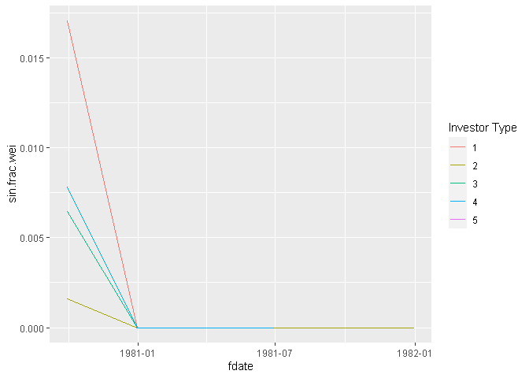

Graphs
================

This code takes the outputs from code run on the WRDS cloud, typically
data.tables, and creates the necessary graphs and visualizations.

## Who holds sin over time

``` r
sin.frac.by.type <- readRDS(file = 'output/sin_frac_by_type.rds')
```

``` r
plot <- ggplot(data= sin.frac.by.type, aes(x=fdate,y=sin.frac.wei, group = factor(typecode)))+
    geom_line(aes(colour=factor(typecode)))+
    labs(color = "Investor Type")
plot
```

<!-- -->
